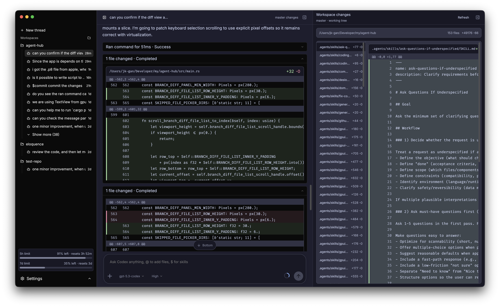

<p align="center">
  
  <h1 align="center">
	  Agent Hub
  </h1>
</p>

<p align="center">Codex App Clone in Rust</p>

Agent Hub is a native desktop client for Codex App Server, built with Rust and GPUI.
Right now, the product direction is intentionally simple: it is a Codex-like client focused on
fast local desktop performance.

This app is currently 100% vibe-coded with gpt-5.3-codex. I needed a quick, usable alternative
because the official Codex app felt laggy and drained battery. I may refactor the code and add
features over time as I keep using it.

## Current Status

The app already supports the main Codex workflow end to end:

- Account login/logout and session state
- Workspace and thread management
- Streaming turns with live tool output
- Approval handling for command and file-change requests
- Model and reasoning-effort selection
- Image attachments
- Workspace Git diff panel

## How It Works

Agent Hub starts `codex app-server` as a child process and communicates over line-delimited
JSON-RPC on stdio. The UI is implemented in GPUI, and most app state and orchestration currently
lives in `src/main.rs`.

If you want protocol details, the docs in `docs/events/` are a good reference for observed
request/response/notification payloads.

## Installation

Make sure you have the `codex` CLI installed. Then go to the
[releases page](https://github.com/jk-gan/agent-hub/releases) to download the latest build.

Only macOS is officially supported right now, because I do not have enough machines to test
other operating systems yet. Contributions for cross-platform support are very welcome.

## Local Development

### Prerequisites

- Rust toolchain (edition 2024 project)
- Codex CLI with `app-server` support
- macOS is the primary tested platform for packaging right now

The app tries to find `codex` at:

- `/opt/homebrew/bin/codex`
- `/usr/local/bin/codex`
- `~/.cargo/bin/codex`
- then falls back to `codex` from `PATH`

### Run

```bash
cargo run
```

### Test

```bash
cargo test
```

## Build

To package the app:

```bash
cargo packager --release
```

The repository also includes a macOS release workflow in `.github/workflows/release.yml`
for signed and notarized release artifacts.

## Project Map

- `src/main.rs`: app shell, UI, state management, and event handling
- `src/codex/app_server.rs`: Codex App Server transport and RPC plumbing
- `src/diff_view.rs`: unified diff parsing used by file-change/branch-diff UI
- `src/components/`: reusable UI cards and approval panel
- `src/sidebar/`: sidebar primitives and interaction patterns
- `docs/events/`: captured API payload examples

## References

- Codex App Server docs: <https://developers.openai.com/codex/app-server>
- Codex harness overview: <https://openai.com/index/unlocking-the-codex-harness/>
